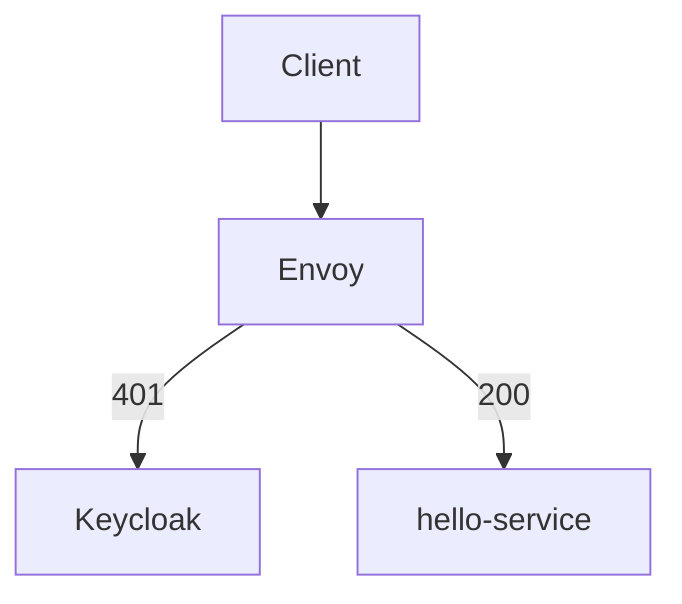

# deviceOIDC

Envoy + Keycloak (OIDC) + ArgoCD (GitOps) on local k3s / Colima

This repository is a **local, fully reproducible OIDC + API Gateway reference setup** on Kubernetes.

Focus:

* clarity over abstraction
* gateway-first security
* GitOps as the control plane
* observability as a first-class concern

No token introspection.
No backend auth logic.
No magic sidecars.

---

## Why this exists

This repo is a **learning and architecture sandbox** for:

* API Gateway–centric security
* Offline JWT validation (JWKS)
* Machine / device authentication patterns
* Declarative GitOps workflows with ArgoCD
* Building an LGTM observability stack bottom-up (logs → metrics → traces)

Everything runs **locally** (Colima + k3s) so nothing is hidden.

---

## Target architecture (north star)

* **Envoy**

  * API Gateway
  * Validates JWTs offline using Keycloak JWKS
  * Blocks unauthorized traffic before it reaches services

* **Keycloak**

  * OIDC / OAuth2 Identity Provider
  * Issues access tokens
  * Publishes JWKS

* **Hello service (Node.js)**

  * No auth logic
  * No Keycloak dependency
  * Purely business-agnostic

* **ArgoCD**

  * App-of-Apps pattern
  * Declarative cluster state

* **Observability (LGTM)**

  * Loki + Promtail: **working**
  * Grafana / Tempo / Mimir: **scaffolded, not wired yet**

---

## What works today

### Security / Gateway

* Envoy validates JWTs offline
* No token introspection
* Keycloak key rotation works via JWKS
* `hello` without token → 401
* `hello` with valid token → 200

### GitOps

* Everything is applied via ArgoCD
* `kubectl` is only used for debugging

### Logging (Loki)

* Promtail runs as DaemonSet
* Reads Docker JSON logs
* Loki ingests correctly
* Old log rejection and rate limits understood and fixed
* Logs queryable by labels:

  * `namespace`
  * `app`
  * `pod`
  * `container`
  * `node`

---

## What is intentionally NOT done yet

* Envoy access logs → Loki
* Keycloak structured logs → Loki
* Metrics via Mimir
* Traces via Tempo
* Grafana dashboards
* Cross-signal correlation

This is deliberate. Logs come first.

---

## Cluster layout

### Namespaces

| Namespace     | Purpose                               |
| ------------- | ------------------------------------- |
| argocd        | GitOps controllers + UI               |
| ingress-nginx | Ingress controller                    |
| gateway       | Envoy                                 |
| keycloak      | Keycloak                              |
| postgres      | Database for Keycloak                 |
| hello         | Demo service                          |
| observability | Loki, Promtail, Grafana, Tempo, Mimir |

---

## Routing model

Host-based routing everywhere:

* `hello.local`
* `keycloak.local`
* (optionally) `argocd.local`

### Default access mode: port-forward

This avoids macOS / Colima networking issues.

| Component | URL                                            |
| --------- | ---------------------------------------------- |
| Ingress   | [http://localhost:8081](http://localhost:8081) |
| ArgoCD    | [http://localhost:8080](http://localhost:8080) |

Routing is done via the `Host` header.

---

## Important endpoints

### Hello API

[http://hello.local/hello](http://hello.local/hello)

### Keycloak UI

Not going through envoy gateway:

[http://keycloak.local/admin](http://keycloak.local:8082/admin)

### OIDC endpoints

* Issuer
  [http://keycloak.local/realms/deviceoidc](http://keycloak.local/realms/deviceoidc)

* Token
  [http://keycloak.local/realms/deviceoidc/protocol/openid-connect/token](http://keycloak.local/realms/deviceoidc/protocol/openid-connect/token)

* JWKS
  [http://keycloak.local/realms/deviceoidc/protocol/openid-connect/certs](http://keycloak.local/realms/deviceoidc/protocol/openid-connect/certs)

---

## Expected behavior (smoke tests)

Hello without token (blocked):

curl -i -H "Host: hello.local" [http://localhost:8081/hello](http://localhost:8081/hello)
→ 401

Hello with token (allowed):

curl -i 
-H "Host: hello.local" 
-H "Authorization: Bearer <token>" 
[http://localhost:8081/hello](http://localhost:8081/hello)
→ 200

---

## Doctor script (mandatory)

The `doctor.sh` script is the **single source of truth** for system health.

It verifies:

* cluster sanity
* ingress routing
* Keycloak OIDC endpoints
* Envoy presence
* Loki ingestion
* optional token mint + API call

Run:

./scripts/doctor.sh

With token test:

KCPASS=secret ./scripts/doctor.sh

---

## Observability status (LGTM)

### Logs

* Promtail → Loki works
* Docker JSON logs ingested
* Labels are consistent and queryable

### Metrics / Traces

* Configs exist
* Not connected yet
* Will be added incrementally

---

## Next steps (deliberate order)

1. Envoy access logs → Loki (JSON)
2. Keycloak structured logs → Loki
3. Hello service structured logs
4. Grafana log dashboards
5. Metrics via Mimir
6. Traces via Tempo
7. Correlation across signals

---

## Design principles

* Gateway owns security
* Services stay dumb
* No introspection
* Observability is mandatory
* Git is the source of truth
* If it works locally, it scales conceptually

---

## Status

The system is **intentionally incomplete**.

What exists is:

* correct
* observable
* explainable

Everything else will be added step by step.
