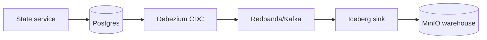

# deviceOIDC

Envoy + Keycloak (OIDC) + ArgoCD (GitOps) on local k3s / Colima

This repository is a **local, fully reproducible OIDC + API Gateway reference setup** on Kubernetes.

Focus:

* clarity over abstraction
* gateway-first security
* GitOps as the control plane
* observability as a first-class concern

No token introspection.
No backend auth logic.
No magic sidecars.

---

## Why this exists

This repo is a **learning and architecture sandbox** for:

* API Gateway–centric security
* Offline JWT validation (JWKS)
* Machine / device authentication patterns
* Declarative GitOps workflows with ArgoCD
* Building an LGTM observability stack bottom-up (logs → metrics → traces)

Everything runs **locally** (Colima + k3s) so nothing is hidden.

---

## Target architecture (north star)

* **Envoy**

  * API Gateway
  * Validates JWTs offline using Keycloak JWKS
  * Blocks unauthorized traffic before it reaches services

* **Keycloak**

  * OIDC / OAuth2 Identity Provider
  * Issues access tokens
  * Publishes JWKS

* **Hello service (Node.js)**

  * No auth logic
  * No Keycloak dependency
  * Purely business-agnostic

* **ArgoCD**

  * App-of-Apps pattern
  * Declarative cluster state

* **Observability (LGTM)**

  * Loki + Promtail: **working**
  * Grafana / Tempo / Mimir: **scaffolded, not wired yet**

---

## What works today

### Security / Gateway

* Envoy validates JWTs offline
* No token introspection
* Keycloak key rotation works via JWKS
* `hello` without token → 401
* `hello` with valid token → 200

### GitOps

* Everything is applied via ArgoCD
* `kubectl` is only used for debugging

### Logging (Loki)

* Promtail runs as DaemonSet
* Reads Docker JSON logs
* Loki ingests correctly
* Old log rejection and rate limits understood and fixed
* Logs queryable by labels:

  * `namespace`
  * `app`
  * `pod`
  * `container`
  * `node`

---

## What is intentionally NOT done yet

* Envoy access logs → Loki
* Keycloak structured logs → Loki
* Metrics via Mimir
* Traces via Tempo
* Grafana dashboards
* Cross-signal correlation

This is deliberate. Logs come first.

---

## Cluster layout

### Namespaces

| Namespace     | Purpose                               |
| ------------- | ------------------------------------- |
| argocd        | GitOps controllers + UI               |
| ingress-nginx | Ingress controller                    |
| gateway       | Envoy                                 |
| keycloak      | Keycloak                              |
| postgres      | Database for Keycloak                 |
| hello         | Demo service                          |
| observability | Loki, Promtail, Grafana, Tempo, Mimir |

---

## Routing model

Host-based routing everywhere:

* `hello.local`
* `keycloak.local`

Default access mode: port-forward to the ingress controller (avoids Colima/macOS networking weirdness).

### Default access mode: port-forward

This avoids macOS / Colima networking issues - achieved with

```bash
make pf-status # gives the status of port forwarding
make pf-start  # starts port forwarding for ingress, argocd, grafana, and keycloak
make pf-stop   # stops port forwarding
```

| Component | URL                                            |
| --------- | ---------------------------------------------- |
| ArgoCD    | [http://argoargocd.local:8080](http://argocd.local:8080) |
| Keycloak  | [http://keycloak.local:8082/admin](http://keycloak.local:8082/admin) |
| Grafana   | [http://grafana.local:3000](http://grafana.local:3000) |

In /etc/hosts, the *.local hostnames are pointing to loopback 127.0.0.1. Routing to backends is done via the Host header.

### Keycloak Access Model (UI vs OIDC)

Keycloak serves two very different consumers:
- Humans (browser / admin UI): use direct port-forward to Keycloak service [http://keycloak.local:8082/admin](http://keycloak.local:8082/admin)
- Machines (slot machine / scripts): go through Envoy (policy + JWT + observability)


**Admin UI (browser):**
- You use keycloak.local:8082 (direct port-forward to Keycloak)
- No Envoy, no NGINX host routing, no “why is my console redirecting to Narnia?”

**OIDC token minting (slotmachine / scripts):**
- You call keycloak.local:8081 (port-forward to ingress-nginx)
- You set Host: keycloak.local
- NGINX routes to Envoy
- Envoy routes to Keycloak
- You get tokens + JWKS like a grown-up service would

#### Keycloak UI

**Admin Console (human access)**
Requires Keycloak port-forward enabled.
- Start:
  - pf-start if you want it automated
- Open:
  - [http://keycloak.local:8082/admin](http://keycloak.local:8082/admin)

**OIDC endpoints (machine access via Envoy)**
These are reached through the edge port-forward (keycloak.local:8081) + Host header:
- Issuer:
  - curl -H 'Host: keycloak.local' http://keycloak.local:8081/realms/deviceoidc
- Token:
  - curl -H 'Host: keycloak.local' http://keycloak.local:8081/realms/deviceoidc/protocol/openid-connect/token
- JWKS:
  - curl -H 'Host: keycloak.local' http://keycloak:8081/realms/deviceoidc/protocol/openid-connect/certs

---

## Important endpoints

### Hello API

[http://hello.local/hello](http://hello.local/hello)

### Keycloak UI

[http://keycloak.local/admin](http://keycloak.local:8082/admin)

### OIDC endpoints

* Issuer
  [http://keycloak.local/realms/deviceoidc](http://keycloak.local/realms/deviceoidc)

* Token
  [http://keycloak.local/realms/deviceoidc/protocol/openid-connect/token](http://keycloak.local/realms/deviceoidc/protocol/openid-connect/token)

* JWKS
  [http://keycloak.local/realms/deviceoidc/protocol/openid-connect/certs](http://keycloak.local/realms/deviceoidc/protocol/openid-connect/certs)

---

## Expected behavior (smoke tests)

Hello without token (blocked):

curl -i -H "Host: hello.local" [http://hello.local:8081/hello](http://hello.local:8081/hello)
→ 401

Hello with token (allowed):

curl -i 
-H "Host: hello.local" 
-H "Authorization: Bearer <token>" 
[http://hello.local:8081/hello](http://hello.local:8081/hello)
→ 200


---

## Doctor script (mandatory)

The `doctor.sh` script is the **single source of truth** for system health.

It verifies:

* cluster sanity
* ingress routing
* Keycloak OIDC endpoints
* Envoy presence
* Loki ingestion
* optional token mint + API call

Run:

./scripts/doctor.sh

With token test:

KCPASS=secret ./scripts/doctor.sh

---

## Observability status (LGTM)

### Logs

* Promtail → Loki works
* Docker JSON logs ingested
* Labels are consistent and queryable

### Metrics / Traces

* Configs exist
* Not connected yet
* Will be added incrementally

---

## Next steps (deliberate order)

1. Envoy access logs → Loki (JSON)
2. Keycloak structured logs → Loki
3. Hello service structured logs
4. Grafana log dashboards
5. Metrics via Mimir
6. Traces via Tempo
7. Correlation across signals

---

## Design principles

* Gateway owns security
* Services stay dumb
* No introspection
* Observability is mandatory
* Git is the source of truth
* If it works locally, it scales conceptually

---

## Status

The system is **intentionally incomplete**.

What exists is:

* correct
* observable
* explainable

# Dummy machine clients

Realized through python script under ./client/machine.py

Use and setup of python:

```bash
make init
make shell
deactivate
make clean
``` 

Minimal client calls (defaults cover most settings):

```bash
# password grant (user/password)
./client/machine.py --password "<KC_PASS>"

# private_key_jwt (client credentials)
./client/machine_key.py --private-key slot-machine.private.pem
```

Generate a client_assertion for curl:

```bash
CLIENT_ASSERTION="$(./client/client_assertion.py --private-key slot-machine.private.pem)"
```

Use with curl (client_credentials + private_key_jwt):

```bash
curl -s -H 'Host: keycloak.local' \
  -d 'grant_type=client_credentials' \
  -d 'client_id=slot-machine' \
  -d 'client_assertion_type=urn:ietf:params:oauth:client-assertion-type:jwt-bearer' \
  -d "client_assertion=${CLIENT_ASSERTION}" \
  http://keycloak.local:8081/realms/deviceoidc/protocol/openid-connect/token
```

Optional overrides if needed:

```bash
./client/machine.py --ingress-base http://localhost:8081 --realm deviceoidc \
  --client-id deviceoidc-cli --username test --machine-id slot-001 --bet 1 --debug

./client/machine_key.py --ingress-base http://localhost:8081 --realm deviceoidc \
  --client-id slot-machine --private-key slot-machine.private.pem --kid "<KID>" \
  --machine-id slot-001 --bet 1 --debug
```

Everything else will be added step by step.

# Dataplatform on-premise demo

### 🧱 Initial Database Setup for Data Platform

We use the existing PostgreSQL instance from the OIDC demo to host
our data platform tables. These are maintained in a dedicated schema
(`dataplatform`) to avoid interference with the Keycloak operational data.

To initialize the database, execute:

```bash
psql \
  -h localhost \
  -p 5432 \
  -U keycloak \
  -d keycloak \
  -f .scripts/dataplatform_init.sql
```

### State service (status generator)

The `state` service simulates status probes by inserting rows into
`dataplatform.status_abfrage` on a fixed interval.

Behavior:
* Picks a random player from `services/state/players.js`
* Picks a random device (with veranstalter + betriebsstaette) from `services/state/devices.js`
* Inserts a row every 10 seconds

Notes:
* Connection is configured via `POSTGRES_*` env vars in `manifests/state/deployment.yaml`
* Data lives in the `dataplatform` schema inside the shared Postgres instance

### CDC pipeline overview



### Object storage (MinIO)

MinIO provides the S3-compatible blob storage used later by Iceberg.
Manifests live in `manifests/minio`.

Default credentials (demo only):
* user: `minioadmin`
* password: `minioadmin`

Access (port-forward):

```bash
kubectl -n minio port-forward svc/minio 9000:9000 9001:9001
```

Then open:
* S3 API: http://localhost:9000
* Console: http://localhost:9001

### Kafka/Redpanda + Connect (CDC backbone)

For the PoC we run a single-node Kafka-compatible broker using Redpanda
to reduce operational overhead. On a production cluster, this should be
replaced with a real Kafka deployment (multi-broker, proper storage and
replication).

Everything runs in the `kafka` namespace.
Manifests live in `manifests/kafka`.

Services:
* Broker bootstrap: `redpanda.kafka.svc.cluster.local:9092`
* Connect REST: `connect.kafka.svc.cluster.local:8083`

Sanity check (in-cluster pub/sub):

```bash
kubectl -n kafka exec redpanda-0 -- sh -lc "rpk topic create sanity -X brokers=redpanda.kafka.svc.cluster.local:9092"
kubectl -n kafka exec redpanda-0 -- sh -lc "echo hello | rpk topic produce sanity -X brokers=redpanda.kafka.svc.cluster.local:9092"
kubectl -n kafka exec redpanda-0 -- sh -lc "rpk topic consume sanity -n 1 -X brokers=redpanda.kafka.svc.cluster.local:9092"
kubectl -n kafka exec redpanda-0 -- sh -lc "rpk topic delete sanity -X brokers=redpanda.kafka.svc.cluster.local:9092"
```

### Debezium CDC (Postgres -> Redpanda)

Create the connector (from repo root):

```bash
kubectl -n kafka exec deploy/connect -- sh -lc \
  "cat <<'JSON' | curl -sS -X POST -H 'Content-Type: application/json' \
  --data-binary @- http://localhost:8083/connectors
{
  \"name\": \"dataplatform-postgres-connector\",
  \"config\": {
    \"connector.class\": \"io.debezium.connector.postgresql.PostgresConnector\",
    \"tasks.max\": \"1\",
    \"database.hostname\": \"postgres.postgres.svc.cluster.local\",
    \"database.port\": \"5432\",
    \"database.user\": \"keycloak\",
    \"database.password\": \"keycloak\",
    \"database.dbname\": \"keycloak\",
    \"database.server.name\": \"dataplatform\",
    \"topic.prefix\": \"dataplatform\",
    \"schema.include.list\": \"dataplatform\",
    \"table.include.list\": \"dataplatform.status_abfrage\",
    \"plugin.name\": \"pgoutput\",
    \"snapshot.mode\": \"initial\",
    \"publication.autocreate.mode\": \"filtered\"
  }
}
JSON"
```

List connectors:

```bash
kubectl -n kafka exec deploy/connect -- sh -lc \
  "curl -sS http://localhost:8083/connectors"
```

Check connector status:

```bash
kubectl -n kafka exec deploy/connect -- sh -lc \
  "curl -sS http://localhost:8083/connectors/dataplatform-postgres-connector/status"
```

Consume CDC events (in-cluster):

```bash
kubectl -n kafka exec redpanda-0 -- sh -lc \
  "rpk topic consume dataplatform.dataplatform.status_abfrage -n 1 -X brokers=redpanda.kafka.svc.cluster.local:9092"
```

Notes:
* Topic naming is `<topic.prefix>.<schema>.<table>` (here: `dataplatform.dataplatform.status_abfrage`)
* `snapshot.mode=initial` emits a one-time snapshot (`op: r`) followed by live changes (`op: c/u/d`)

### Iceberg sink (Redpanda -> MinIO)
Note on "AWS" config: Iceberg uses Hadoop S3A to talk to S3-compatible storage. MinIO speaks S3, so the settings look like AWS (`fs.s3a.*`, access/secret keys, region), but they are just the S3 protocol knobs pointed at MinIO.

Create the MinIO bucket (one-time):

```bash
kubectl -n minio apply -f manifests/minio/warehouse-job.yaml
```

Iceberg sink runs in a dedicated Kafka Connect deployment:
* Connect REST: `iceberg-connect.kafka.svc.cluster.local:8083`
* Image: `docker.io/h4rkon/iceberg-connect:latest` (built from the public Databricks Iceberg Connect runtime release)

Create the Iceberg sink connector:

```bash
kubectl -n kafka exec deploy/iceberg-connect -- sh -lc \
  "cat <<'JSON' | curl -sS -X POST -H 'Content-Type: application/json' \
  --data-binary @- http://localhost:8083/connectors
{
  \"name\": \"iceberg-sink\",
  \"config\": {
  \"connector.class\": \"io.tabular.iceberg.connect.IcebergSinkConnector\",
    \"tasks.max\": \"1\",
    \"topics\": \"dataplatform.dataplatform.status_abfrage\",
    \"iceberg.catalog.type\": \"hadoop\",
    \"iceberg.catalog.warehouse\": \"s3a://warehouse/\",
  \"iceberg.catalog.io-impl\": \"org.apache.iceberg.hadoop.HadoopFileIO\",
  \"iceberg.catalog.hadoop.fs.s3a.endpoint\": \"http://minio.minio.svc.cluster.local:9000\",
  \"iceberg.catalog.hadoop.fs.s3a.connection.ssl.enabled\": \"false\",
  \"iceberg.catalog.hadoop.fs.s3a.path.style.access\": \"true\",
  \"iceberg.catalog.hadoop.fs.s3a.access.key\": \"minioadmin\",
  \"iceberg.catalog.hadoop.fs.s3a.secret.key\": \"minioadmin\",
  \"iceberg.catalog.hadoop.fs.s3a.aws.credentials.provider\": \"org.apache.hadoop.fs.s3a.SimpleAWSCredentialsProvider\",
  \"iceberg.catalog.hadoop.fs.s3a.endpoint.region\": \"us-east-1\",
  \"iceberg.catalog.hadoop.fs.s3a.region\": \"us-east-1\",
    \"iceberg.tables\": \"dataplatform.status_abfrage\",
    \"iceberg.tables.auto-create-enabled\": \"true\",
    \"iceberg.tables.auto-create-props.write.format.default\": \"parquet\"
  }
}
JSON"
```

Check sink status:

```bash
kubectl -n kafka exec deploy/iceberg-connect -- sh -lc \
  "curl -sS http://localhost:8083/connectors/iceberg-sink/status"
```

### Trino (SQL on Iceberg)

Trino provides SQL access to the Iceberg tables stored in MinIO.
Manifests live in `manifests/trino`, and the Argo app is `apps/trino-app.yaml`.

Port-forward Trino:

```bash
kubectl -n trino port-forward svc/trino 8080:8080
```

Example queries:

```sql
SHOW SCHEMAS FROM iceberg;
SHOW TABLES FROM iceberg.dataplatform;
SELECT * FROM iceberg.dataplatform.status_abfrage LIMIT 5;
```

### dbt (silver layer)

The `dbt/` folder contains a minimal dbt project that flattens the CDC
envelope into a silver table (`dbt/models/silver/status_abfrage.sql`).

Quick start (local dbt-trino):

```bash
pip install dbt-trino
cp dbt/profiles.yml.example ~/.dbt/profiles.yml
dbt --project-dir dbt run
```
